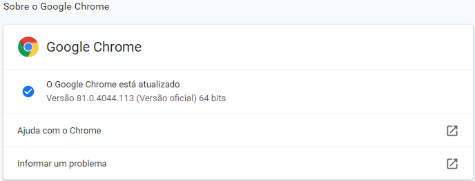
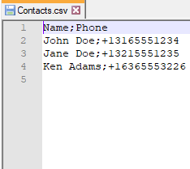
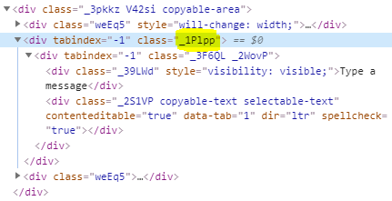
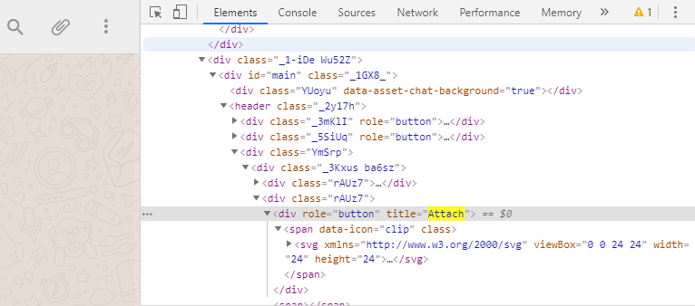

# Whatsapp-Bot
Simple Whatsapp bot that sends custom messages and attach multiple images and videos to a CSV contact list. User can specify the contacts that will receive the message and customize each message based on the contact's name. Uses selenium and chromedriver to navigate.

## Main features
* Customized messages
* Multiple attachments per contact
* CSV-based contact lookup
* Prints progress on debug console 
* Uses only reliable and well known libraries

## Prerequisites and installation
* Python
* Selenium
* Chromedriver
* Pandas
* CSV contact list, with names __exactly__ as they are on the source Phone

## Unfamiliar with Python or Selenium? See the complete setup step by step below
* Install Python from https://www.python.org/
  * When installing, check the box "Add Python to Environment Variables"
* On windows, open cmd.exe and type the following commands
  * "pip install selenium"
  * "pip install pandas"
* Install VS Code from https://code.visualstudio.com/
  * Or any other IDE that you prefer (PyCharm, Spyder etc.)
* Install Chrome's webdriver from http://chromedriver.chromium.org/downloads
  * chromedriver version must be the same as your Google Chrome version
  * To check your version:
  
  
  
  
  
  * Unzip chromedriver.exe to the same folder where your project is located (chromedriver v81 is attached here)
  * Open VS Code and click on customize -> Python
  
  
  
  * Start -> Open Folder -> Navigate to your project's folder
  
  
  
  ## WhatsappBot.py code - Step by step execution description
  * Import selenium, time, pandas and os
  
  
  
  * Write custom message and leave a _NAME_ key to replace with contact's names
  
  
  
  * Import CSV file with names and phone numbers and convert the generated dataframe to string
    * Depending on your CSV format, you may need to adjust the separator (space, comma, colon, semicolon etc.)

  
  
  
  
  * Get names and paths of all images on _Images_ folder (where all attachments must be located)
  
  
  
  * Create 2 custom functions: "clean" phone numbers and retrieve the contacts's first names
  
  
  
  * Create a webdriver object and navigate to whatsapp web
  
  
  
  * Wait 15 seconds for page to load and for user to scan QR code
  
  
  
  * Loop all contacts from the CSV file
  
  
  
  * Find chat search box HTML tag and type the phone number
  
  
  
  
  
  
  
  * Get the found contact's HTML tag using its full name __exactly__ as it is on the phone's contacts list and click it
  
  
  
  

  * Get the message box HTML tag, write the customize message and send it
  
  
  
  
  
  * Find the attachment button (clip shaped) HTML tag and click it
  
  
  
  
  
  * Find the Photos And Videos input HTML tag and use send_keys to input the location of all attachments
  
  
  
  
  
  * Find the "Send attachment" button HTML tag and click it
  
  
  
  
  
  * Repeat the process for the next contact on the CSV
  
  
  
  
